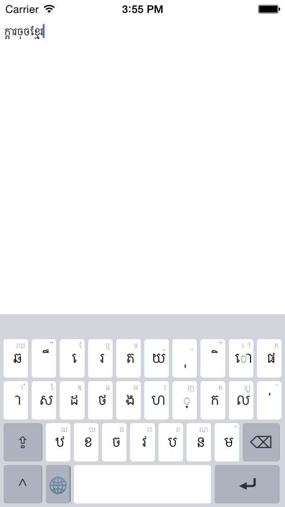
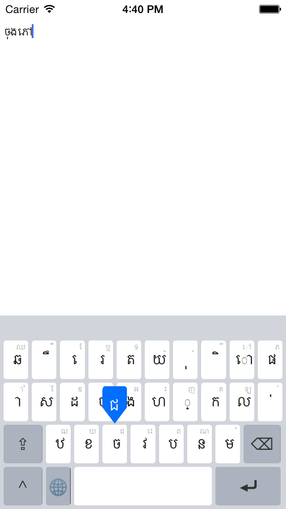

KhmerKeyboard
===================

An iOS custom keyboard extension written in Swift derived from ELDeveloperKeyboard. 

Features
------------

* Use swipe up gesture instead of shift button -> faster input

## Screenshots

Todo
-------------

* Rearrange shift mode layout and alt mode layout so that most frequent characters are placed in shift mode layout
* Add shadow to pop up button
* Change the globe button icon from blue to black